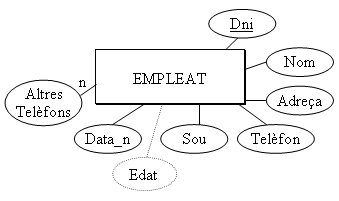
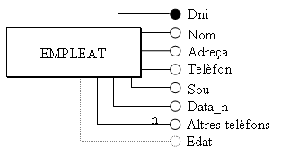

Bases de Dades

Un **ATRIBUT** és cadascuna de les característiques d'una entitat que ens interessen. 

Per exemple en l'entitat EMPLEAT tindrem els atributs *nom, DNI, adreça, telèfon, sou* i *data de naixement*. 

No considerarem atributs les característiques que no ens interessen (estatura, talla pantalons, etc.) 

Una ocurrència d'entitat tindrà un **VALOR** per a cada atribut, per exemple *Joan Peris, 18.901.234, 964-22.33.44, 1.200,00€., 12-5-1960.*

Però de vegades potser que el contingut d'un atribut siga el valor **NUL** (per exemple si no té telèfon o el desconeixem). 

Els atributs poden ser **SIMPLES** o **COMPOSTOS**, si estan formats per una única informació o per més d'una. Així, un exemple d'atribut compost seria el nom que podria estar format per: *nom=(nom de pila, primer cognom, segon cognom)*. 

Poden haver atributs **MULTIVALUATS**, que vol dir que poden agafar més d'un valor. Per exemple suposem que en el cas anterior considerem el camp *altres telèfons*** (per si en l'empresa hi ha moments que hem de localitzar l'empleat urgentment). Potser un empleat no tinga cap valor en aquest camp. I potser un altre en tinga dos (el mòbil i el d'una segona residència). En general fugirem d'aquestos camps per comoditat, però el model ho accepta. 

També poden haver atributs **DERIVATS**, és a dir, atributs que es poden calcular a partir d'altres. Podria ser el cas del camp *edat*, que es pot calcular a partir de la data del sistema i de *data de naixement*. 

El model necessita poder identificar cada ocurrència sense marge d'error. Hi haurà algun atribut (o conjunt d'atributs) que acomplirà aquesta premisa d'identificar unívocament. I per a que això siga possible, aquest atribut haurà de tenir valors distints per a totes les ocurrències (sinó no podria identificar-les); i al mateix temps no podrà tenir en cap cas el valor nul. En l'exemple EMPLEAT, el *nom* o el *DNI* servirien per identificar. En canvi el sou no serviria, ja que més d'un empleat pot tenir el mateix sou. El telèfon tampoc, perquè potser siga nul. 

Als atributs (o conjunts d'atributs) que acompleixen la condició anterior els anomenarem **CLAUS CANDIDATES**, i d'entre totes les claus candidates triarem una i l'anomenarem **CLAU PRINCIPAL**. 

Totes les entitats han de tenir una clau principal. És una de les restriccions del Model E/R. 

Representarem els atributs amb un cercle unit a l'entitat per una línia, i en l'interior o al costat posarem el nom de l'atribut. La clau principal l'assenyalarem subratllant-la, o amb el cercle negre. 

Per als atributs multivaluats posarem ***n*** en la línia. I els derivats els representarem amb línies discontínues. 

Ací tindríem dues maneres (absolutament equivalents) de representar l'entitat EMPLEAT amb els seus atributs.

|
| |
|| :- | :- | :- |

[« Anterior](aplicaci_a_lexemple.md) | [Següent »](aplicaci_a_lexemple0.md)

Llicenciat sota la [Llicència Creative Commons Reconeixement NoComercial CompartirIgual 3.0](http://creativecommons.org/licenses/by-nc-sa/3.0/)
**Created with an evaluation copy of Aspose.Words. To discover the full versions of our APIs please visit: https://products.aspose.com/words/**

[ref1]: 32_atributs.002.png
[ref2]: 32_atributs.003.png
