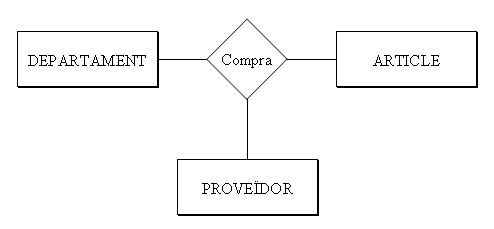

# 4.1 Relació

**RELACIÓ**[1] és una associació o correspondència entre entitats.

El **TIPUS DE RELACIÓ** serà l’estructura genèrica, l’associació entre dos
tipus d’entitat, i englobarà les **OCURRÈNCIES DE RELACIÓ** , que relacionaran
ocurrències de les entitats (Joan Peris pertany al departament de
Comptabilitat, Pilar Gomis al de Vendes, ...).

Representarem la relació per un rombe, amb el nom de la relació a l’interior.
Habitualment serà un verb que descriu la relació entre les dues entitats.
Unirem el rombe amb els rectangles de les entitats per mig de línies.

Així tindrem:

En una Relació poden intervenir 2 entitats (Relació Binària), 3 entitats
(ternària), o fins i tot més. Aquest número serà el **GRAU** de la relació.

Un exemple de relació ternària seria:

I una ocurrència d’aquesta relació podria ser: Comptabilitat compra una
calculadora a Distribucions Garcia, S.L.

També es pot donar el cas que només intervinga una entitat. Aleshores seria
reflexiva o de grau 1. Per exemple, els empleats tenen un supervisor, que
també és un empleat de la companyia.

Per últim, també es pot donar el cas que dues entitats tinguen entre elles més
d’una relació. En el nostre exemple els empleats pertanyen als departaments.
Però alguns empleats dirigeixen els departaments, i aquesta és una relació
distinta de l’anterior. Per això convé posar el nom de la relació, per evitar
confusions.

> **_Nota_**

> Potser a mida que fem exercicis ens entre perea de posar nom a totes les
> relacions, sobretot perquè moltes estarà molt clar què signifiquen. Però
> haurem de posar sempre el nom en aquelles que puguen dur a confusió o
> aquelles que no està clar el seu significat.

  

  

* * *

[1] Per a no confondre amb les Relacions del Model Relacional, alguns autors
prefereixen traduir el mot anglès _Relationship_ com **Interrelació** o
**Vincle** en compte de **Relació**

Llicenciat sota la  [Llicència Creative Commons Reconeixement NoComercial
CompartirIgual 3.0](http://creativecommons.org/licenses/by-nc-sa/3.0/)

