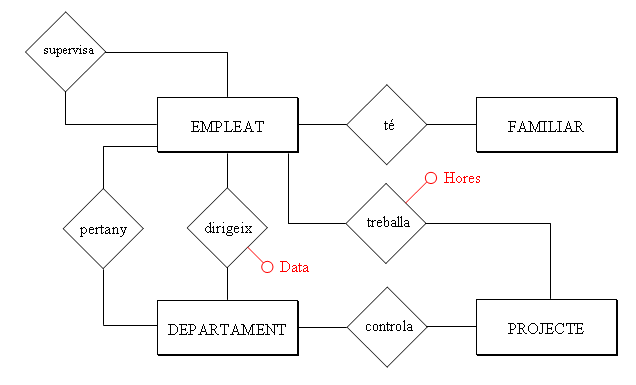

# 4. Les Relacions del Model E/R

Encara no hem relacionat les entitats entre elles, i per tant encara no hem
dit que tal treballador pertany a tal departament (Joan Peris està en
Comptabilitat, per exemple), o que tal treballador està en tal projecte
dedicant-li tantes hores setmanals.

<video width="320" height="240" controls>
  <source src="T02_Peli2.mp4" type="video/mp4">
  Tu navegador no soporta la etiqueta de video.
</video>

## 4.1 Relació

Encara no hem relacionat les entitats entre elles, i per tant encara no hem
dit que tal treballador pertany a tal departament (Joan Peris està en
Comptabilitat, per exemple), o que tal treballador està en tal projecte
dedicant-li tantes hores setmanals.

**RELACIÓ** [1] és una associació o correspondència entre entitats.

El **TIPUS DE RELACIÓ** serà l’estructura genèrica, l’associació entre dos
tipus d’entitat, i englobarà les **OCURRÈNCIES DE RELACIÓ** , que relacionaran
ocurrències de les entitats (Joan Peris pertany al departament de
Comptabilitat, Pilar Gomis al de Vendes, ...).

Representarem la relació per un rombe, amb el nom de la relació a l’interior.
Habitualment serà un verb que descriu la relació entre les dues entitats.
Unirem el rombe amb els rectangles de les entitats per mig de línies.

Així tindrem:

En una Relació poden intervenir 2 entitats (Relació Binària), 3 entitats
(ternària), o fins i tot més. Aquest número serà el **GRAU** de la relació.

Un exemple de relació ternària seria:

I una ocurrència d’aquesta relació podria ser: Comptabilitat compra una
calculadora a Distribucions Garcia, S.L.

També es pot donar el cas que només intervinga una entitat. Aleshores seria
reflexiva o de grau 1. Per exemple, els empleats tenen un supervisor, que
també és un empleat de la companyia.

Per últim, també es pot donar el cas que dues entitats tinguen entre elles més
d’una relació. En el nostre exemple els empleats pertanyen als departaments.
Però alguns empleats dirigeixen els departaments, i aquesta és una relació
distinta de l’anterior. Per això convé posar el nom de la relació, per evitar
confusions.

> **_Nota_**

> Potser a mida que fem exercicis ens entre perea de posar nom a totes les
> relacions, sobretot perquè moltes estarà molt clar què signifiquen. Però
> haurem de posar sempre el nom en aquelles que puguen dur a confusió o
> aquelles que no està clar el seu significat.

  

  

* * *

[1] Per a no confondre amb les Relacions del Model Relacional, alguns autors
prefereixen traduir el mot anglès _Relationship_ com **Interrelació** o
**Vincle** en compte de **Relació**

### Aplicació a l'exemple

Després d'incorporar les relacions, el nostre exemple quedarà:

## 4.2 Atributs de Relació

Les relacions també poden tenir atributs, igual que les entitats. Un atribut
de relació seria el número d’hores que treballa un empleat en un projecte, que
seria un atribut de la relació **treballa**. Per exemple _Joan Peris_ treballa
en el projecte _Estudi rendiment_ , i li dedica 5 hores setmanals. Fixeu-vos
que no és un atribut ni d’empleat ni de projecte, sinó de la relació que hi ha
entre elles. Un altre atribut de relació podria ser la data quan un empleat
comença a dirigir un departament.

Representarem els atributs de relació com els atributs d'entitat, però ara
units a les relacions.

### Aplicació a l'exemple

Posarem en roig els atributs de relació:

## 4.3 Tipus de Relació o Cardinalitat

Encara no hem reflectit tota la realitat. Per exemple no hem pogut expressar
que un empleat pertany únicament a un departament, i en canvi pot estar en més
d’un projecte.

Això ho farem per mig de la cardinalitat, que ens durà a distintes classes de
relacions.

La **CARDINALITAT** especifica el número d'ocurrències d'una entitat que poden
intervenir en la relació per cada ocurrència de l'altra entitat.

Una ocurrència d'EMPLEAT (un empleat concret) només pot estar relacionat amb
una ocurrència de DEPARTAMENT (Joan Peris pertany a Comptabilitat, i a cap
altre departament més). En canvi una ocurrència de DEPARTAMENT pot estar
relacionada amb moltes ocurrències d'EMPLEAT (tots els que hi pertanyen).
Aleshores la relació PERTANY entre DEPARTAMENT i EMPLEAT té raó de
cardinalitat **1:N** (un departament relacionat amb molts empleats, però un
empleat amb un departament).

Ho representarem així:

o millor:

  

Els distints tipus de relacions que hi pot haver són:

  * **1:1** (llegirem: **ú a ú**) com a màxim una ocurrència de cada. Per exemple la relació DIRIGEIX (un empleat dirigeix com a molt un departament, i un departament és dirigit per un empleat).

  * **1:N** (llegirem: **ú a ena** o **ú a molts**) en una entitat una ocurrència i en l'altra moltes.

  * **M:N** (llegirem: **ema a ena** o **molts a molts**) hi ha més d'una ocurrència en cada entitat. Per exemple la relació TREBALLA (un empleat pot treballar en més d'un projecte, i en un projecte pot treballar més d'un empleat).

Per a poder distingir aquesta cardinalitat ens farem dues preguntes, resultat
de fixar una ocurrència en una entitat i veure quantes ocurrències es
relacionen en l'altra entitat. És a dir, per a una ocurrència d'una, quantes
hi ha de l'altra. En l'exemple de més amunt:

  * A un departament determinat, quants empleats poden pertànyer? (molts).

  * Un empleat determinat, a quants departaments pot pertànyer? (a un).

Aquestes preguntes normalment tenen molt fàcil contestació. Si hi ha dubte
hauríem d'investigar millor en les especificacions.

> _**Nota**_
>
> La cardinalitat M:N també la podríem representar N:N. Senzillament vol dir
> que són moltes ocurrències de cada entitat per cadascuna de l'altra. En
> aquestos apunts normalment posaré M:N, senzillament perquè "sóna" millor.

### Aplicació a l'exemple

L'exemple cada vegada està més complet:

Llicenciat sota la  [Llicència Creative Commons Reconeixement NoComercial
CompartirIgual 3.0](http://creativecommons.org/licenses/by-nc-sa/3.0/)

