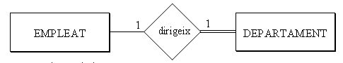

# 6.1 Cardinalitat màxima i mínima. Participació total.

CARDINALITAT MÀXIMA I MÍNIMA

### CARDINALITAT MÀXIMA i MÍNIMA d’una entitat que participa en una relació,
són respectivament el número màxim i mínim d’ocurrències d’aquesta entitat que
estan relacionades amb una ocurrència de l’altra entitat

Per exemple

Un empleat pot dirigir 0 o 1 departament, i un departament és dirigit (com a
mínim i com a màxim) per 1 empleat. Ho posarem entre parèntesis **(card.
mínima, card. màxima)** al costat de l’entitat[1]. En realitat el nou concepte
és la cardinalitat mínima, ja que la màxima és la cardinalitat d'abans. Els
valors habituals de cardinalitat mínima són 0 i 1.

PARTICIPACIÓ TOTAL O PARCIAL

Una entitat participa de forma **TOTAL** en una relació, si totes les seues
ocurrències participen en alguna ocurrència de la relació. Així DEPARTAMENT
participa de forma total, ja que tot departament té un cap. En canvi EMPLEAT
no participa de forma total, ja que no tot empleat dirigeix un departament.
Les entitats que participen de forma total tenen de cardinalitat mínima 1. Les
que no 0. **Per tant amb la participació total o parcial aconseguim el mateix
que amb la cardinalitat mínima.**

Representarem que una entitat participa de forma total en una relació amb una
doble ratlla

Com que de les dues maneres anteriors, la cardinalitat mínima i la
participació total o parcial, aconseguim exactament el mateix, en aquestos
apunts **només representarem la participació total o parcial** , ja que té una
representació gràfica molt senzilla.

  

* * *

[1] Hi ha autors que les posen a l’inrevés, en les altres entitats.

Llicenciat sota la  [Llicència Creative Commons Reconeixement NoComercial
CompartirIgual 3.0](http://creativecommons.org/licenses/by-nc-sa/3.0/)

