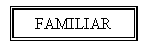

# 6.2 Entitats dèbils

No totes les entitats són iguals. En les normals, que anomenarem **REGULARS**
, les ocurrències tenen existència pròpia.

En canvi, en les entitats **DÈBILS** , l’existència de les ocurrències depèn
de l’existència de l’ocurrència d’una altra entitat, i així si desapareix
aquesta última, haurien de desaparèixer també totes aquelles.

Per exemple els familiars de Joan Peris podrien ser [Marta, dona], [Isabel,
filla] i [Marc, fill]. Si desapareix l’empleat Joan Peris haurien de
desaparèixer també els seus familiars.

Les entitats dèbils les representarem per un doble rectangle:

La cardinalitat mínima i màxima de l’entitat regular en la relació amb la
dèbil sempre és (1,1). O el que és el mateix, la dèbil sempre participa de
forma total en la relació 1:N.

Tal com hem comentat les coses fins ara direm que l’entitat dèbil té una
**DEPENDÈNCIA EN EXISTÈNCIA**[1]****.

Però podem anar més enllà, si a més de la dependència en existència considerem
que per a identificar una ocurrència de l’entitat dèbil ens fa falta la clau
de l’entitat regular de la qual depèn. Si en una biblioteca tenim més d’un
exemplar de cada llibre, tindríem l’entitat LLIBRE (on estaria tota la
informació: títol, autor, editorial, ...) i una altra que seria EXEMPLAR. Serà
lògic que per a identificar un determinat exemplar utilitzem el codi del
llibre més el número d’exemplar.

Un altre exemple podria ser el de PROVÍNCIES i MUNICIPIS. El codi de la
província consta de 2 xifres (Castelló és el 12). Per a identificar un
municipi s'utilitzen les 2 xifres del codi de la privíncia i 4 més per al
municipi. I fa falta el codi de la província, perquè si no es repetirien.

Aquesta dependència, encara més restrictiva que la d’existència, l’anomenarem
**DEPENDÈNCIA EN IDENTIFICACIÓ**. Per a marcar aquesta dependència posarem
**ID** al costat de la relació.

En el nostre exemple, si considerem que per a identificar l’entitat FAMILIAR
és suficient amb l’atribut Nom, serà en existència (el cas d’una companyia
menuda). Si considerem que no és suficient, serà en identificació i la clau
principal serà el DNI de l’empleat més el Nom del familiar.

Representarem la dependència en existència així (si considerem que amb el nom
del familiar tenim prou per a identificar):

I la dependència en identificació així (si considerem que també fa falta
l'identificador de l'empleat, que és el DNI):

Representarem aquesta última de forma alternativa amb el rombe de doble ratlla

* * *

[1] En la pràctica podríem pensar que tota entitat que participa de forma
total en una relació és dèbil com a mínim en existència. Per exemple: la
participació total de Familiar vol dir que tot familiar ho és d'un empleat; la
dependència en existència vol dir que no pot existir un familiar sense
l'empleat. Com veiem la diferència és molt subtil. A pesar d'això intentarem
fer l’esforç de diferenciar ambdós casos, perquè en el següent tema sí que ens
durà a dues maneres de procedir diferents.

Llicenciat sota la  [Llicència Creative Commons Reconeixement NoComercial
CompartirIgual 3.0](http://creativecommons.org/licenses/by-nc-sa/3.0/)

