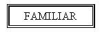
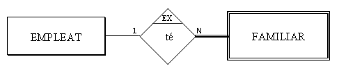
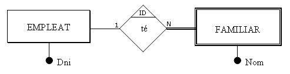
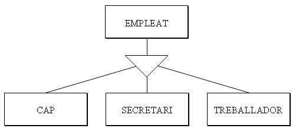
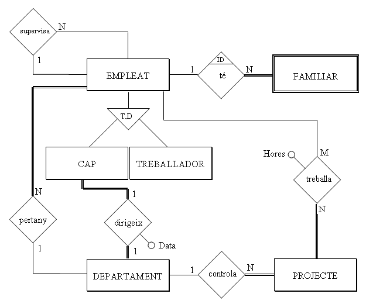

# 6. Model E/R Estès

El que hem vist fins ara proporciona una eina per descriure la realitat molt
potent. Però encara hi ha restriccions del món real que no podem representar.

Per exemple, de l'entitat FAMILIAR no ens interessen tots els familiars del
món, únicament els familiars dels empleats. És més, si un empleat deixa de
treballar en l'empresa, ja no ens interessen els familiars.

O un altre exemple, hem posat que la relació DIRIGEIX és **1:1** , i això ens
podria fer pensar que les dues entitats, EMPLEAT i DEPARTAMENT, participen
exactament de la mateixa manera en la relació. Però no és exactament així, ja
que tot departament tindrà un empleat que el dirigeix, però no tot empleat té
un departament a dirigir.

Això fa que el Model E/R s'haja desenvolupat amb les aportacions de més
autors, fins arribar al **MODEL ENTITAT-RELACIÓ ESTÈS**.

## 6.1 Cardinalitat màxima i mínima. Participació total.

**CARDINALITAT MÀXIMA i MÍNIMA** d’una entitat que participa en una relació,
són respectivament el número màxim i mínim d’ocurrències d’aquesta entitat que
estan relacionades amb una ocurrència de l’altra entitat

**Per exemple**

Un empleat pot dirigir 0 o 1 departament, i un departament és dirigit (com a
mínim i com a màxim) per 1 empleat. Ho posarem entre parèntesis **(card.
mínima, card. màxima)** al costat de l’entitat[1]. En realitat el nou concepte
és la cardinalitat mínima, ja que la màxima és la cardinalitat d'abans. Els
valors habituals de cardinalitat mínima són 0 i 1.

**PARTICIPACIÓ TOTAL O PARCIAL**

Una entitat participa de forma **TOTAL** en una relació, si totes les seues
ocurrències participen en alguna ocurrència de la relació. Així DEPARTAMENT
participa de forma total, ja que tot departament té un cap. En canvi EMPLEAT
no participa de forma total, ja que no tot empleat dirigeix un departament.
Les entitats que participen de forma total tenen de cardinalitat mínima 1. Les
que no 0. **Per tant amb la participació total o parcial aconseguim el mateix
que amb la cardinalitat mínima.**

Representarem que una entitat participa de forma total en una relació amb una
doble ratlla

Com que de les dues maneres anteriors, la cardinalitat mínima i la
participació total o parcial, aconseguim exactament el mateix, en aquestos
apunts **només representarem la participació total o parcial** , ja que té una
representació gràfica molt senzilla.

  

* * *

[1] Hi ha autors que les posen a l’inrevés, en les altres entitats.

### Aplicació a l'exemple

Aplicant la participació total i parcial, el nostre exemple quedarà:

## 6.2 Entitats dèbils

No totes les entitats són iguals. En les normals, que anomenarem **REGULARS**
, les ocurrències tenen existència pròpia.

En canvi, en les entitats **DÈBILS** , l’existència de les ocurrències depèn
de l’existència de l’ocurrència d’una altra entitat, i així si desapareix
aquesta última, haurien de desaparèixer també totes aquelles.

Per exemple els familiars de Joan Peris podrien ser [Marta, dona], [Isabel,
filla] i [Marc, fill]. Si desapareix l’empleat Joan Peris haurien de
desaparèixer també els seus familiars.

Les entitats dèbils les representarem per un doble rectangle:

La cardinalitat mínima i màxima de l’entitat regular en la relació amb la
dèbil sempre és (1,1). O el que és el mateix, la dèbil sempre participa de
forma total en la relació 1:N.

Tal com hem comentat les coses fins ara direm que l’entitat dèbil té una
**DEPENDÈNCIA EN EXISTÈNCIA**[1]****.

Però podem anar més enllà, si a més de la dependència en existència considerem
que per a identificar una ocurrència de l’entitat dèbil ens fa falta la clau
de l’entitat regular de la qual depèn. Si en una biblioteca tenim més d’un
exemplar de cada llibre, tindríem l’entitat LLIBRE (on estaria tota la
informació: títol, autor, editorial, ...) i una altra que seria EXEMPLAR. Serà
lògic que per a identificar un determinat exemplar utilitzem el codi del
llibre més el número d’exemplar.

Un altre exemple podria ser el de PROVÍNCIES i MUNICIPIS. El codi de la
província consta de 2 xifres (Castelló és el 12). Per a identificar un
municipi s'utilitzen les 2 xifres del codi de la privíncia i 4 més per al
municipi. I fa falta el codi de la província, perquè si no es repetirien.

Aquesta dependència, encara més restrictiva que la d’existència, l’anomenarem
**DEPENDÈNCIA EN IDENTIFICACIÓ**. Per a marcar aquesta dependència posarem
**ID** al costat de la relació.

En el nostre exemple, si considerem que per a identificar l’entitat FAMILIAR
és suficient amb l’atribut Nom, serà en existència (el cas d’una companyia
menuda). Si considerem que no és suficient, serà en identificació i la clau
principal serà el DNI de l’empleat més el Nom del familiar.

Representarem la dependència en existència així (si considerem que amb el nom
del familiar tenim prou per a identificar):

I la dependència en identificació així (si considerem que també fa falta
l'identificador de l'empleat, que és el DNI):

Representarem aquesta última de forma alternativa amb el rombe de doble ratlla

* * *

[1] En la pràctica podríem pensar que tota entitat que participa de forma
total en una relació és dèbil com a mínim en existència. Per exemple: la
participació total de Familiar vol dir que tot familiar ho és d'un empleat; la
dependència en existència vol dir que no pot existir un familiar sense
l'empleat. Com veiem la diferència és molt subtil. A pesar d'això intentarem
fer l’esforç de diferenciar ambdós casos, perquè en el següent tema sí que ens
durà a dues maneres de procedir diferents.

## 6.3 Generalització i herència

Anem a comentar, prou per damunt, un altre aspecte recollit en el Model E/R
Estès. I és quan una entitat es pot subdividir en d'altres. Per exemple
podríem refinar l'entitat EMPLEAT en CAPS, SECRETARIS i TREBALLADORS.

Empleat seria el **SUPERTIPUS** o **SUPERCLASSE** i els altres els
**SUBTIPUS**. EMPLEAT seria la **GENERALITZACIÓ** dels altres. I els altres
serien l'**ESPECIALITZACIÓ** d'EMPLEAT.

Un aspecte important és l'**HERÈNCIA** , que consisteix en què els subtipus
heretaran els atributs del supertipus, de manera que no caldrà repetir-los.
Únicament s'hauran de declarar els atributs específics de la subclasse (en CAP
podríem tenir l'opinió del seu departament; en SECRETARI número de pulsacions
per segon o coneixements d'informàtica; en TREBALLADOR si està disposat a fer
hores extres).

Hi ha més d'una classe d'especialització depenent de dos criteris:

  * Si se **solapen** (una ocurrència de la superclasse pot pertànyer a més d'una subclasse) o són **disjuntes**(una ocurrència de la superclasse només pot pertànyer a una subclasse). Per exemple els empleats especialitzats per torn de treball (matí, vesprada, nit), pot donar-se el cas que algun treballador treballe matí i vesprada de forma no intensiva (atenció a públic), i per tant seria solapada. Un exemple d'especialització no solapada seria l'especialització per tipus de treball (cap, secretari, treballador), on un empleat no pot pertànyer a dues subclasses.
  

  * Si és **total** (totes les ocurrències del supertipus pertanyen a algun subtipus) o **parcial**. Un exemple de total seria una especialització per dedicació a l'empresa (completa o no completa). Un exemple de parcial seria l'especialització per tipus de treball (cap, secretari, treballador) ja que podria haver algun treballador que no coincidesca (un assessor,...) 

No anem a insistir molt en aquest tema perquè a més, en el tractament
posterior (quan passem al Model Relacional), de vegades es representen totes
les entitats, però de vegades per motius pràctics se simplifica (suprimint bé
el supertipus, bé els subtipus).

### Aplicació a l'exemple

L'exemple, considerant únicament els subtipus **CAP** i **TREBALLADOR**
d’**EMPLEAT** , quedaria així:

On "**T,D** " que està dins del triangle significa que l'especialització és
Total i Disjunta

Llicenciat sota la  [Llicència Creative Commons Reconeixement NoComercial
CompartirIgual 3.0](http://creativecommons.org/licenses/by-nc-sa/3.0/)

