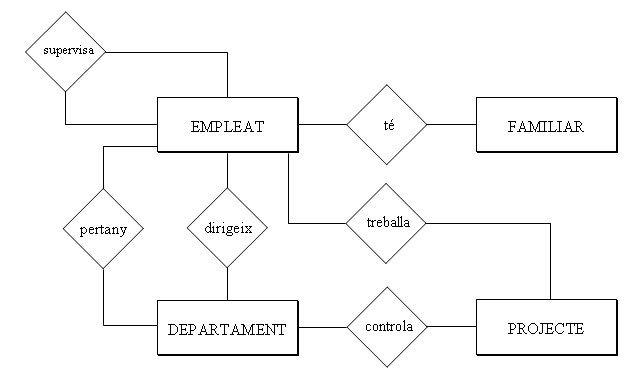

# Aplicació a l'exemple

Després d'incorporar les relacions, el nostre exemple quedarà:

Llicenciat sota la  [Llicència Creative Commons Reconeixement NoComercial
CompartirIgual 3.0](http://creativecommons.org/licenses/by-nc-sa/3.0/)

